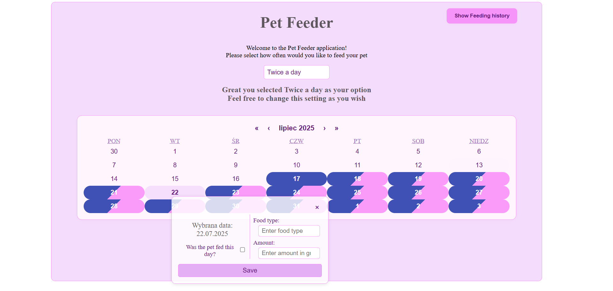

# 📦 Pet_feeder

A simple **Progressive Web App (PWA)** that allows users to mark the days they fed their pets and receive notifications if they forget.

🟢 [Live App on Vercel](https://pet-feeder-five.vercel.app/)

This app is serverless — all data is stored locally in the browser. It can be downloaded as a PWA on any device. Notifications will remind you when you're about to miss a feeding.

> ⚠️ Notifications require the browser tab to be open or the app to run in the background.

---

## 🖼️ Preview



## 🚀 Getting Started (How to run on localhost)

1. Navigate to the project directory:

```bash
cd petfeeder-vite
```

2. Install dependencies and start the development server:

```bash
npm install
npm run dev
```

> ✅ Open your browser at http://localhost:5173 (or the port displayed in the console).

## 🌐 Build & Run on Local Network

To build the app and run it on your local network:

```bash
npm run build
npx serve dist
```

> You may want to use `npx serve -l tcp://(Your local network ip):3000 dist` instead if you encounter any issues

> 📱This allows you to access the app from your phone or other devices connected to the same Wi-Fi.

## 🛠️ Technologies

- React
- TypeScript
- Vite
- PWA (Service Workers, Manifest)

## ✨ Features

- Mark days your pet was fed
- Local notifications if you forget
- Works offline as a PWA
- Data persists locally in the browser

## ⚖️ License

This project is for demonstration purposes only. All rights reserved © 2025 Artur Charyło.

> 📌 You are **not allowed** to use, copy, or modify this code for commercial or personal projects.
